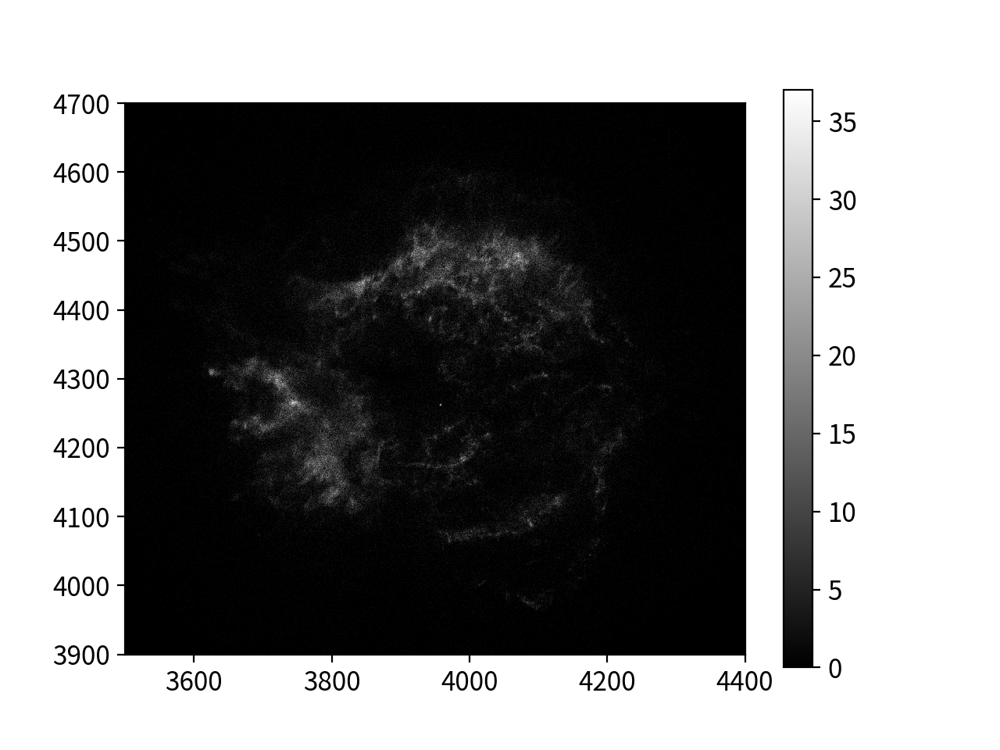

# Physics_Seminar
## About
This repository is for the assignment of `Physics seminar class`. Only useful for my group mates.

Create x-y plot of specified energy band from fits file.

## Installation
### 1. Prerequisites
If you don't have necessary packages, install them:
```shell
pip install numpy
pip install matplotlib
pip install astropy
pip install pyyaml
```

**IMPORTANT**
In version 1, the script required pandas. In version 2, it requires astropy instead of pandas.

### 2. Download
Please clone this repository. If you don't have git tools, please download from [Releases](https://github.com/skrbcr/Physics_Seminar/releases).

## Usage
1. Open downloaded `Physics_Seminar` folder.
2. Write recipe file. `recipes/example.yaml` is an example of recipe files. You can also see [how to write recipe files](#how-to-write-recipe-files).
3. Run the python script:
```shell
python3 picture.py your_recipe_file.yaml
```
4. Images will be generated! If you have some problems or questions or find some bug (and also my english ;)), feel free to ask me!!

**IMPORTANT**  
In version 1, you have to make csv from fits. In version 2, however, you no longer have to do so. Just specify your original fits file in recipe files.

Sample:  


## How to write recipe files
Recipe files are written in YAML. You can create and edit YAML files with any text editor.

Here is an example of recipe files:

```yaml
data: /path_to_your_fits_file # data file
outname: result/log/  # output file name prefix
range: [[3500,4400],[3900,4700]]  # range of images
bin: 1  # size of one pixel
log: 0  # set log scale (1: log; 0: linear) 
cmap: binary  # specify cmap (see https://matplotlib.org/stable/tutorials/colors/colormaps.html)
band:   # set band data
  - energy: [1800,2000] # range of energy
    cmin: 0  # min counts (pixel with counts less than cmin is not displayed)
    cmax: 20 # max counts (pixel with counts more than cmax is not displayed)
  - energy: [2300,2600] # you may not specify cmin and cmax
  - energy: [2600,2900] # then, the program automatically sets options
```

Let me explain what each option means:
- data: Your fits file. The program makes images from this CSV file.
- outname: Output image file name prefix. With above recipe, output file name is `./result/log/ene_xxxx_yyyy.png` (`ene_xxxx_yyyy` is automatically set by the program).
- range: Range of images. [[left,right],[bottom,top]]. If you specify nothing, all the x-y range of data is drawn.
- bin: Size of one pixel. Defualt: 10
- log: Draw in log scale. Defualt: 0
- cmap: Specify matplotlib cmap. See [matplotlib colormaps](https://matplotlib.org/stable/tutorials/colors/colormaps.html). Defualt: gray
- band: 
    - energy: Range of energy. Events with energy in this range are drawn.
    - cmin: Minimum counts. Pixel with counts less than cmin is not displayed. If you specify nothing, the program automatically set.
    - cmax: Maximum counts. Pixel with counts more than cman is not displayed. If you specify nothing, the program automatically set.

Only `data`, `outname` and `band/energy` is necessary.

